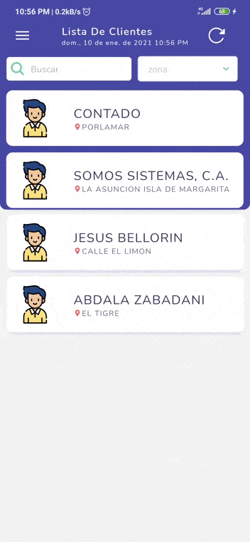
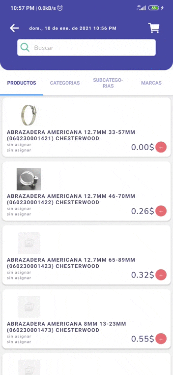

# Hello!

## this is an app i made for my work as Developer in Somossistemas.com named Fuerza de Ventas or SalesForce in english 
 with this app the erp users can make orders for his clients by the app which will be posible to monitorize in the erp; all the data including clients and products is saved in a local database made with realm DB

## Next you can see some modules of the app 

### Home

here the app will display the list of clients avaibles for the user been able to see his names an direccition including a filter to search by names

additionally the hamburguer menu buttom and a reload action this is to reload the data of the local database 

___

### Client

with this view the app display the info of the selected client like his ID and credit avaible then select a discount plan to proceed a create an order for him

___

### Categories

this view is for look and select products to add to the cart it has 3 filters with categories, subcategories and brand , with an additional one to scroll through all products and search by name

___

### Product

in this view you can see the details of a selected product like the price code dimensions and more then add this product to the cart if needed

___

### navigation

in this view you can see the main menu to navigate from the 3 init views including home, products, and a view to see the user orders that are pending

